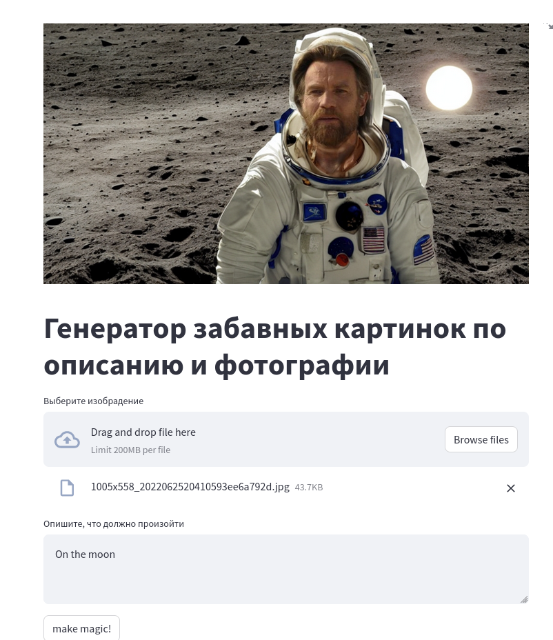

# :computer: Software Engenering Project

[](https://github.com/AAEfimov/URFU_PI/actions/workflows/python-app.yml)

Наш проект представляет web приложение и TG бот для модификации фотографий, согласно описанию,  
также генерирует по полученной картинке музыку!  
Попробуйте, будет весело

> May the Force be with you

Изображение  | Результат работы (on The Moon)
---------|:-------:
  |   

## :gem: How To

Как запустить приложение  
1) для начала Вам необходимо установить все библиотеки
```Python
pip install -r requirements.txt
```
2) Запустить streamlit приложение можно следующей командой
```Python
streamlit run streamlit_api.py 
```
3) Запустить FastApi приложение можно следующей командой
```Python
uvicorn fastapi_ex:pe_urfu --reload
```
4) Запустить TG bot можно седующий командой  
    * Найдите @botfather в Telegram  
    * Начните разговор с BotFather, нажав кнопку «Start».  
    * Введите /newbot и следуйте инструкциям, чтобы настроить нового бота. BotFather
   предоставит вам токен, который вы будете использовать для аутентификации своего бота и предоставления ему доступа к API Telegram.  

```Python
echo 'export BOT_TOKEN=your-bot-token-here' > .env
python3 tg_bot.py
```
## :gem: Модели:

<p>fffiloni/img-to-music https://huggingface.co/spaces/fffiloni/img-to-music</p>
<p>mikonvergence/theaTRON https://huggingface.co/spaces/mikonvergence/theaTRON</p>

## :gem: Команда:  

:arrow_forward: Абдюшев Никита Юрьевич (РИМ-130906),  
:arrow_forward: Ефимов Алексей Александрович (РИМ-130907),  
:arrow_forward: Кулиев Эмир Шамсаддинович  (РИМ-130908).

## TODO list REMOVE THIS

#### markdown
links https://gist.github.com/rxaviers/7360908  
https://www.markdownguide.org/basic-syntax/  
  
#### Задание:  
:white_check_mark:   1. Сформируйте команду из 3-4 человек.  
:white_check_mark:   2. Создайте репозиторий на GitHub, который будет использоваться для командной разработки приложения.  
:white_check_mark:   3. Изучите возможности готовых библиотек машинного обучения.  
:white_check_mark:   4. Сформулируйте задачу, которую вы хотите решить с помощью машинного обучения.  
:white_check_mark:   5. Реализуйте решение выбранной вами задачи в коде с использованием готовой библиотеки машинного обучения.  
:white_check_mark:   6. Отправьте реализованное решение в репозиторий на GitHub.  
:x:   7. Оформите документацию на ваше решение в репозитории.  
:white_check_mark:   8. Отправьте ссылку на созданный репозиторий GitHub на платформу для проверки.  

Рекомендуется использовать одну из следующих библиотек машинного обучения:  
Hugging Face (https://huggingface.co/),  
TensorFlow Hub (https://www.tensorflow.org/hub),  
PyTorch Hub (https://pytorch.org/hub/),  
Keras Applications (https://keras.io/api/applications/).  
  
Пример репозитория – https://github.com/sozykin/ml_sentiment  


