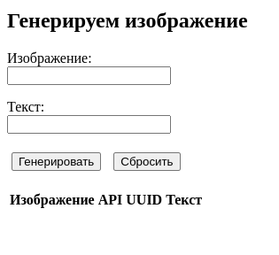

# :computer: Software Engenering Project

[](https://github.com/AAEfimov/URFU_PI/actions/workflows/python-app.yml)
[](https://opensource.org/licenses/Apache-2.0)
[](http://isitmaintained.com/project/AAEfimov/URFU_PI "Percentage of issues still open")
[](http://isitmaintained.com/project/AAEfimov/URFU_PI "Average time to resolve an issue")

Наш проект представляет streamlit web приложение, fastapi и TG бот для генерации забавных  
изображений по фотографии,  согласно описанию.
Также генерирует по полученной картинке музыку!  
Попробуйте, будет весело

> May the Force be with you

Изображение  | Результат работы (on The Moon)
---------|:-------:
  |     

## :gem: Релизы

[Release list](https://github.com/AAEfimov/URFU_PI/releases)

## :gem: Source code documentation

[Source code doc](https://htmlpreview.github.io/?https://github.com/AAEfimov/URFU_PI/blob/main/html/URFU_PI/index.html)  

## :gem: Examples

#### [urfuproject.streamlit.app](https://urfuproject.streamlit.app/)  
#### [mlskill.ru (fast api)](http://mlskill.ru:8000/)  
#### [TG bot](https://t.me/PE_blalba_bot)

## :gem: How To

Как запустить приложение  
1) для начала Вам необходимо установить все библиотеки
```Python
pip install -r requirements.txt
```
2) Запустить streamlit приложение можно следующей командой
```Python
streamlit run streamlit_api.py 
```
3) Запустить FastApi приложение можно следующей командой
```Python
uvicorn fastapi_ex:pe_urfu --reload
```
:arrow_right: [Список поддерживаемых запросов](fastapi_doc.md)  

для удобства использования API из web была добавлена JS форма взаимодействия с ним

  

4) Запустить TG bot можно седующий командой  
    * Найдите @botfather в Telegram  
    * Начните разговор с BotFather, нажав кнопку «Start».  
    * Введите /newbot и следуйте инструкциям, чтобы настроить нового бота. BotFather
   предоставит вам токен, который вы будете использовать для аутентификации своего бота и предоставления ему доступа к API Telegram.  

```Python
echo 'export BOT_TOKEN=your-bot-token-here' > .env
python3 tg_bot.py
```
## :gem: Модели:

<p>mikonvergence/theaTRON https://huggingface.co/spaces/mikonvergence/theaTRON</p>

## :gem: Команда:  

:arrow_forward: Абдюшев Никита Юрьевич (РИМ-130906),  
:arrow_forward: Ефимов Алексей Александрович (РИМ-130907),  
:arrow_forward: Кулиев Эмир Шамсаддинович  (РИМ-130908).

## Useful links

#### markdown
links https://gist.github.com/rxaviers/7360908  
https://www.markdownguide.org/basic-syntax/  

### documentation generate   

```
pip3 install pdoc3
pdoc --html .
``` 
